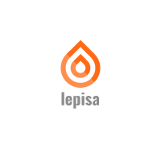
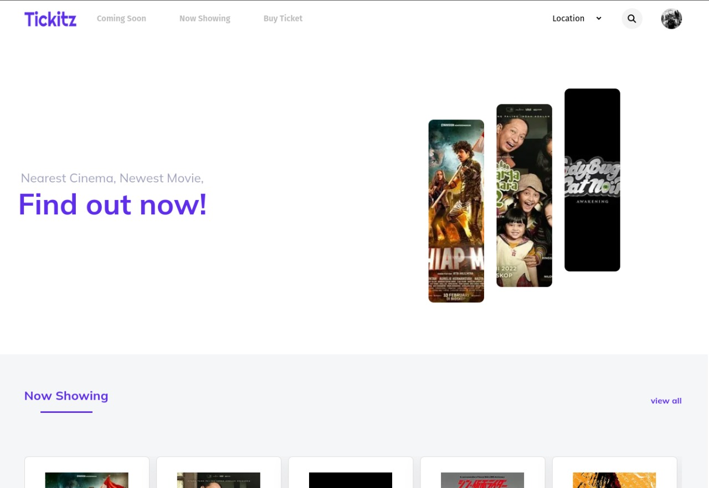
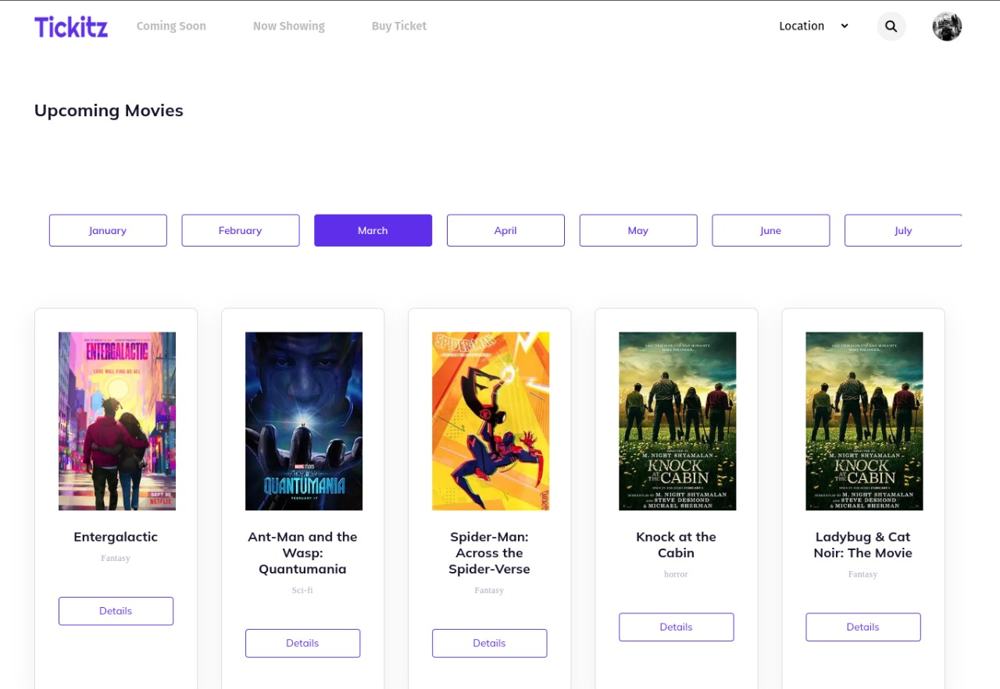
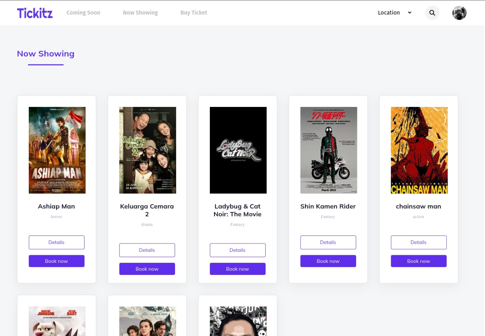
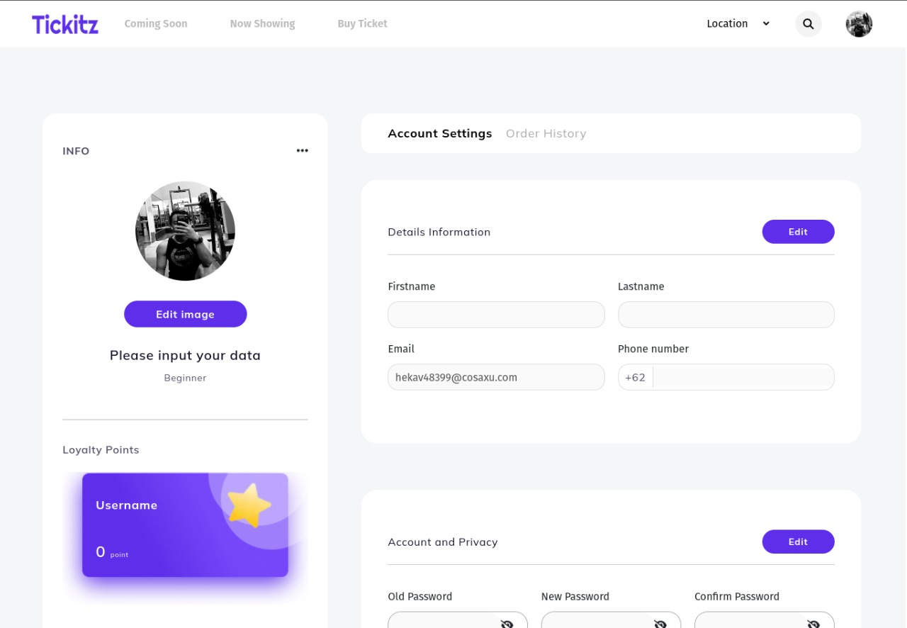
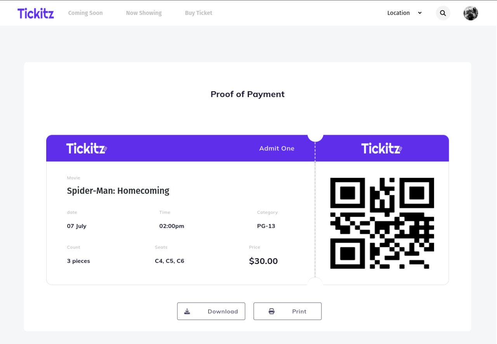
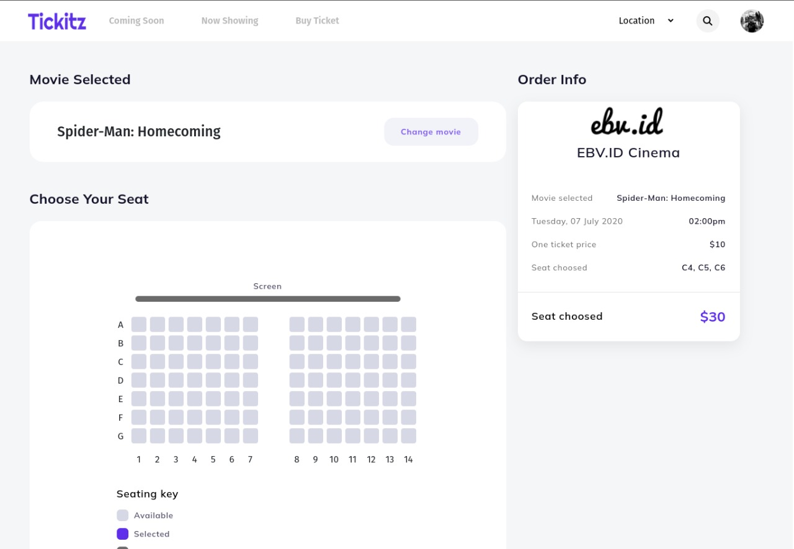

<td align="center">
        <a href="https://github.com/rzkiyprtm">
           
        </a>
        </td>

<h1 align="center">LEPISA</h1>

  Built with NEXT JS.

## Table of Contents

- [Introduction](#introduction)
- [Features](#features)
- [Requirements](#requirements)
- [Usage](#usage-for-development)
- [Screenshots](#screenshots)
- [Contributors](#contributors)

## Introduction

<b>Tickitz</b> by Lepisa Team.
<tr>You can test the web online here: https://lepisa-fe.vercel.app/</tr>
<b>Email: nidopi1150@cnogs.com || Password: 123</b>

## Features

- Auth
- Movie Detail
- View Now Showing & Upcoming Movies
- Transactions History
- etc

## Requirements

- [`next js`](https://reactjs.org/)

## Usage for development

1. Open your terminal or command prompt
2. Type `git clone https://github.com/farisan/lepisa-fe.git`
3. Open with your text editor
4. Start to edit and develop

## Screenshots

    
    
    
    
    
    
    
    

## Related Project
* [`Monlight Wallet Website`](https://github.com/rzkiyprtm/monlight-wallet)

## Contributors

  <table>
    <tr>
      <td align="center">
        <a href="https://github.com/rzkiyprtm">
           
          <b>Imam Basri</b>
        </a>
        </td>
        <td align="center">
        <a href="https://github.com/rzkiyprtm">
           
          <b>Muhammad Farisan</b>
        </a>
        </td>
        <td align="center">
        <a href="https://github.com/rzkiyprtm">
           
          <b>Dian Kartika Ratna Sari</b>
        </a>
        </td>
        <td align="center">
        <a href="https://github.com/rzkiyprtm">
           
          <b>Rizky Putra Pratama</b>
        </a>
        </td>
        <td align="center">
        <a href="https://github.com/rzkiyprtm">
           
          <b>Rival Alfalah</b>
        </a>
        </td>
  </table>

